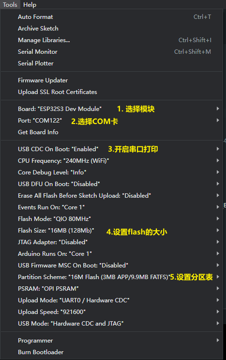

<h1 align = "center">🌟T-Embed-PN532🌟</h1>

 
  
  
  
  

* [Switch to English](./README.md)

## :one:Product 🎁

| Version |   v1.0 24-03-15   |
|:-------:|:-----------------:|
|  模块   | ESP32-S3-WROOM-1U |
|  Flash  |       16MB        |
|  PSRAM  |        8MB        |
|  屏幕   |      320x170      |

### 关于无线收发设备

T-Embed-PN532 有一个内置的 Sub-GHz 模块，基于 `CC1101` 收发器和无线电天线(最大距离50米)。CC1101芯片和天线都设计在 300-348 MHz、387-464 MHz 和 779-928 MHz 频段工作。

Sub-GHz应用支持基于CC1101收发器的外部无线电模块。

### 文件夹结构：
~~~
├─boards  : 板子的一些信息，用于 platformio.ini 配置工程；
├─data    : 程序用到的图片资源；
├─example : 一些例子；
├─firmare : `factory` 编译生成的固件；
├─hardware: 板子的原理图、芯片资料；
├─lib     : 项目中用到的库；
~~~

## :two: Example 🎯

项目 example 文件夹下提供了一些例子，这些例子可以在 PlatformIO (PIO) 和 Arduion 上运行，但是我更推荐使用 PIO，因为这些例子都是在 PIO 上开发的，**所有的例子都可在 PIO 上运行**，但在 Arduion 上可能遇到编译错误，但不要担心，作者会加紧测试 Arduion 环境下的编译情况。

**在 Arduion 环境下编译通过的例子：**

- ✅ bq25896_test : 电池管理测试，在串口中打印电池状态。
- ✅ cc1101_recv_irq ：无线接收测试，在串口中显示接收到的消息。
- ✅ cc1101_send_irq ：无线发送测试，在串口中显示发送的消息。
- ✅ display_test ：屏幕显示测试；
- ✅ encode_test ：编码器测试。
- ❌ factory ：出厂程序目前只能在 PlatformIO 上编译下载；
- ✅ infrared_recv_test: 红外接收
- ✅ infrared_send_test: 红外发送
- ✅ lvgl_test ：lvgl benchmark 和压力测试；
- ✅ pn532_test ：NFC测试，在串口中显示 IC 卡的信息。
- ✅ tf_card_test ：SD 卡测试，在串口中显示读取到的的文件名。
- ✅ record_test : 录制 15 秒钟的音频，并保存到 SD 卡中。
- ✅ voice_test : 扬声器测试，从SD卡读取音频。
- ✅ ws2812_test ：LED 灯测试；

## :three: PlatformIO 快速开始

 提示：下面一个是安装的流程，更详细的安装，可以使用浏览器搜索 PlatformIO 的安装教程；例如：[PlatformIO 环境安装](https://zhuanlan.zhihu.com/p/509527710)

1. 安装 [VScode]((https://code.visualstudio.com/)) 和 [Python](https://www.python.org/)，并且克隆或下载此项目；
2. 在 VScode 的扩展中搜索 PlatformIO 的插件，然后安装它；
3. 在 PlatformIO 插件安装完成后，需要重新启动 VScode，然后用 VScode 打开此工程；
4. 打开此工程后，PlatformIO 会自动的下载需要的三方库和依赖，第一次这个过程比较长，情耐心等待；
5. 当所有的依赖安装后，可以打开 `platformio.ini` 配置文件，在 `example` 中取消注释来选择一个例程，选择后按下 `ctrl+s` 保存 .ini 配置文件；
6. 点击 VScode 下面的 :ballot_box_with_check: 编译工程，然后插上 USB 在 VScode 下面选择 COM 口；
7. 最后点击 :arrow_right: 按键将程序下载到 Flash 中；

## :four: Arduion 快速开始

:exclamation: :exclamation: :exclamation: 注意：我们更推荐使用 PlatformIO，使用 Arduion 可能编译不通过，可以参考 **2️⃣-Example** 查看那些例子是在 Arduion 环境测试编译成功的。

1. 安装 [Arduino IDE](https://www.arduino.cc/en/software)，并且克隆或下载此项目；
2. 安装 esp32 的工具包，打开 Arduion IDE，点击打开 `File->Perferences`，然后将 `https://espressif.github.io/arduino-esp32/package_esp32_index.json` 粘贴到如下图的位置，然后点击 :ok:，等待工具包下载完成；

3. 复制 `此项目/lib/` 下的所有文件，并且粘贴到 Arduion 的库路径(一般是 `C:\Users\YourName\Documents\Arduino\libraries`)下面；
4. 打开 Arduion IDE，点击左上角 `File->Open` 打开 `此项目下/example/xxx/xxx.ino` 中的一个例子；
5. 然后配置 Arduion，按照下面的方式配置完成后，就可以点击 Arduion 左上角按键进行编译下载了；

## :five: Other
待添加...